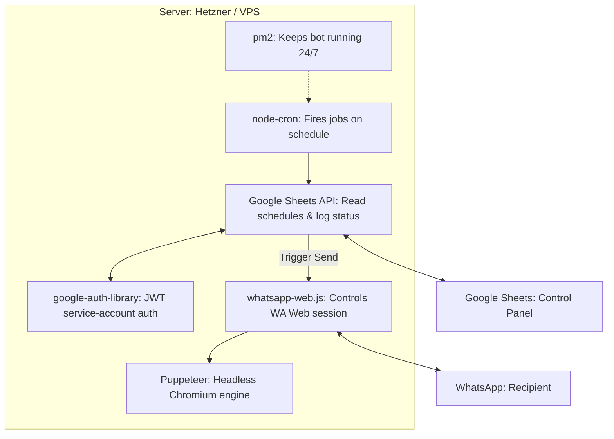

# WhatsApp Google Sheets Scheduler Bot

A **Node.js automation server** that sends **scheduled WhatsApp messages** using **Google Sheets as a control panel**.

The bot reads message schedules from a Google Sheet and automatically sends WhatsApp messages at the specified date and time. After sending, it logs the timestamp back into the sheet.

This allows you to **manage scheduled WhatsApp messages without modifying code**, simply by editing a spreadsheet.

The bot uses:

- **whatsapp-web.js** to control WhatsApp Web
- **Google Sheets API** to store schedules
- **node-cron** to schedule message delivery
- **Service Account authentication** for secure Google API access
- **pm2** to keep the bot running 24/7 on a server

---

## How It Works (Visual Workflow)


```
┌─────────────────────────────────────────────────────────────────────────┐
│                          SERVER (Hetzner / VPS)                        │
│                                                                         │
│   ┌─────────────────────────────────────────────────────────────┐      │
│   │  pm2  — keeps the bot running 24/7, restarts on crash      │      │
│   │                                                             │      │
│   │   ┌─────────────────────────────────────────────────┐      │      │
│   │   │  Node.js  (index.js + src/)                     │      │      │
│   │   │                                                  │      │      │
│   │   │   dotenv ──► loads .env vars at startup         │      │      │
│   │   │                                                  │      │      │
│   │   │   ┌──────────────┐   ┌──────────────────────┐   │      │      │
│   │   │   │  node-cron   │   │  google-auth-library  │   │      │      │
│   │   │   │              │   │                       │   │      │      │
│   │   │   │  Fires jobs  │   │  JWT service-account  │   │      │      │
│   │   │   │  on schedule │   │  auth to Google APIs  │   │      │      │
│   │   │   └──────┬───────┘   └──────────┬────────────┘   │      │      │
│   │   │          │                       │                │      │      │
│   │   │          ▼                       ▼                │      │      │
│   │   │   ┌──────────────┐   ┌──────────────────────┐   │      │      │
│   │   │   │whatsapp-web.js│  │  Google Sheets API    │   │      │      │
│   │   │   │              │   │                       │   │      │      │
│   │   │   │  Controls WA │   │  Read schedules       │   │      │      │
│   │   │   │  Web session │   │  Log sent timestamp   │   │      │      │
│   │   │   └──────┬───────┘   └──────────┬────────────┘   │      │      │
│   │   │          │                       │                │      │      │
│   │   │          ▼                       │                │      │      │
│   │   │   ┌──────────────┐               │                │      │      │
│   │   │   │  Puppeteer   │               │                │      │      │
│   │   │   │  (headless   │               │                │      │      │
│   │   │   │  Chromium)   │               │                │      │      │
│   │   │   └──────┬───────┘               │                │      │      │
│   │   └──────────┼───────────────────────┼────────────────┘      │      │
│   └──────────────┼───────────────────────┼───────────────────────┘      │
└──────────────────┼───────────────────────┼──────────────────────────────┘
                   │                       │
                  ◄ ►                      ◄ ►
         ┌─────────────────┐    ┌──────────────────────┐
         │    WhatsApp     │    │    Google Sheet      │
         │   (recipient)   │    │  (your spreadsheet)  │
         │                 │    │                      │
         │  ◄─ receives    │    │  ◄─ read schedules   │
         │  ──► commands   │    │  ──► log timestamps  │
         └─────────────────┘    └──────────────────────┘
```

---

## The 7-Step Process

```
[1] node-cron fires — checks for pending messages every 30 minutes
    ↓
[2] googleSheets.js reads the Google Sheet — fetches all schedule rows
    ↓
[3] scheduler.js evaluates each row — mode, date, interval, finish date
    ↓
[4] whatsapp-web.js sends the message via Puppeteer (headless Chromium)
    ↓
[5] googleSheets.js logs the sent timestamp back to the sheet
    ↓
[6] Finished rows are archived to the "done" tab automatically
    ↓
[7] notifier.js alerts the owner on WhatsApp if anything goes wrong
```

---

# Features

- Send **scheduled WhatsApp messages automatically**
- Five scheduling modes: **once, daily, weekly, monthly, scheduled (interval-based), end_of_month**
- **Interval-based scheduling**: send every N days, weeks, or months from a start date
- **Add new schedules via WhatsApp** using the `!new-schedule` command — no spreadsheet access needed
- Manage everything from **Google Sheets** — no code changes needed
- **Automatic sync every 30 minutes**
- **Log messages sent back to the spreadsheet**
- **server_updated_at** cell updated on every sync
- Remote bot commands through WhatsApp (owner-only)
- Persistent WhatsApp login using **LocalAuth**
- **Human-like staggered delays** between messages to reduce spam flags
- **Archive finished rows** automatically to a "done" sheet to keep the active spreadsheet clean
- **Unit tested** with Jest — pure parsing logic covered by 228 test cases across 26 groups in 6 test files

---

# Project Structure

```
whatsapp-project/
├── src/
│   ├── services/
│   │   └── googleSheets.js   ← Google Sheets auth, row fetching, cell writing, addRowToSheet
│   ├── utils/
│   │   ├── parser.js         ← parseRowData(), isRowFinished(), parseNewScheduleInput() — pure, no deps
│   │   ├── formatter.js      ← formatMessage(), formatTimestamp(), getNewScheduleTemplate(), buildScheduleConfirmation(), sortByMode(), sortByDate() — pure
│   │   ├── dateUtils.js      ← computeNextOccurrence(parsed, now) — pure, no deps. Used by scheduler.js for !pending-date
│   │   ├── logger.js         ← logMessageToFile(), getLastLogLines() — local file logger
│   │   ├── notifier.js       ← withRetry(), notifyOwner() — retry logic and owner alerts
│   │   └── messages.js       ← getHelpMessage(), getLogsMessage() — pure WhatsApp reply builders
│   └── scheduler.js          ← Core engine: sync, cron scheduling, send, archive, pending, save
├── google-apps-script/
│   └── sheet-utils.gs          ← Google Apps Script for checkbox exclusivity and sheet setup
├── tests/
│   ├── parser.test.js        ← Jest unit tests for parser.js (107 test cases across 11 groups)
│   ├── logger.test.js        ← Jest unit tests for logger.js (19 test cases across 2 groups)
│   ├── notifier.test.js      ← Jest unit tests for notifier.js (13 test cases across 4 groups)
│   ├── formatter.test.js     ← Jest unit tests for formatter.js (38 test cases across 5 groups)
│   ├── messages.test.js      ← Jest unit tests for messages.js (21 test cases across 2 groups)
│   └── scheduler.pending-date.test.js ← Jest unit tests for computeNextOccurrence() and sortByDate() (30 test cases across 6 groups)
├── index.js                  ← Entry point — WhatsApp client, command routing, session state
├── ecosystem.config.js       ← pm2 process manager config (for server deploy)
├── creds.json                ← Google Service Account credentials (local only, gitignored)
├── .env                      ← Environment variables (gitignored)
├── .env.example              ← Template for required environment variables
└── package.json
```

---

# Prerequisites

### 1. Node.js

Download and install Node.js from https://nodejs.org

```bash
node -v
npm -v
```

### 2. Google Account

You need a Google account to create a Cloud Project, enable the Sheets API, and generate a Service Account.

### 3. WhatsApp Account

The bot connects to WhatsApp Web — you must scan a QR code with your phone the first time it runs.

---

# Installation

```bash
git clone https://github.com/YOUR_USERNAME/WhatsApp-Scheduler-Bot.git
cd WhatsApp-Scheduler-Bot
npm install
```

---

# Google Sheets API Setup

## Step 1 — Create a Google Cloud Project

Go to https://console.cloud.google.com/

1. Click **Select Project** → **New Project**
2. Give it a name and click **Create**

## Step 2 — Enable the Google Sheets API

1. Go to **APIs & Services → Library**
2. Search for **Google Sheets API**
3. Click **Enable**

## Step 3 — Create a Service Account

1. Go to **APIs & Services → Credentials**
2. Click **Create Credentials → Service Account**
3. Name it `whatsapp-bot`, click **Create and Continue**
4. Skip the permission step, click **Done**

## Step 4 — Generate Credentials JSON

1. Click the service account you created → **Keys**
2. Click **Add Key → Create New Key → JSON**
3. Download the file and rename it `creds.json`
4. Place it in your project root folder

## Step 5 — Share Your Google Sheet

Open your Google Sheet, click **Share**, and add the service account email from `creds.json`:

```
xxxxx@xxxxx.iam.gserviceaccount.com
```

Give it **Editor** permission.

## Step 6 — Set up Checkbox Exclusivity & Sheet Headers
To initialize your sheet and enforce mutual exclusivity for checkbox modes:
1. Open your Google Sheet.
2. Click **Extensions → Apps Script**.
3. Delete any existing code.
4. Copy the code from `google-apps-script/sheet-utils.gs` in this project.
5. Paste it into the editor.
6. Click the **Save** icon (diskette).
7. Refresh your Google Sheet tab. You will see a new **Bot Setup** menu in the top bar.
8. Click **Bot Setup → Initialize Sheet Structure** to create the required headers.
9. Any time you check a box for a scheduling mode, the script will automatically ensure only one is selected for that row.

---

# Google Sheet Structure

> **⚠️ CRITICAL: DO NOT MODIFY COLUMN STRUCTURE**
> The bot relies on the exact column order and header names defined below. The first column (`#`) must remain in position A1, even if empty. Deleting or rearranging columns will break the bot's ability to read and update your schedule.

Your sheet must have the following columns:

```
# | subject | message | number | date | hour | once | daily | weekly | monthly | scheduled | end_of_month | interval_days | interval_weeks | interval_months | date_finish_schedule | log_last_sent_message | server_updated_at
```

Example rows:

| # | subject | message | number | date | hour | once | daily | weekly | monthly | scheduled | end_of_month | interval_days | interval_weeks | interval_months | date_finish_schedule | log_last_sent_message | server_updated_at |
|---|---------|---------|--------|------|------|------|-------|--------|---------|-----------|--------------|--------------|----------------|---------------------|----------------------|-------------------|
| 1 | Reminder | Hello! | 5511999999999 | 20/06/2026 | 14:30 | ☑ | ☐ | ☐ | ☐ | ☐ | ☐ | | | | | | |
| 2 | Follow up | Check in! | 5511999999999 | 01/04/2026 | 09:00 | ☐ | ☐ | ☐ | ☐ | ☑ | ☐ | 2 | | | | | |

### Column descriptions

**number** — WhatsApp number with country code, digits only. Example: `5511999999999`

**date** — Format `DD/MM/YYYY` for all modes. Example: `20/06/2026`

**hour** — Format `HH:MM` 24h. Example: `14:30`

**once / daily / weekly / monthly / scheduled / end_of_month** — Checkboxes. Only one can be selected per row (enforced by sheet data validation via Apps Script):
- **once** — sends at the exact date and time, never again
- **daily** — sends every day at the defined hour. Stops after `date_finish_schedule` if set, otherwise runs indefinitely.
- **weekly** — sends every week on the same weekday derived from the date column. Stops after `date_finish_schedule` if set, otherwise runs indefinitely.
- **monthly** — sends every month on the same day number. Stops after `date_finish_schedule` if set, otherwise runs indefinitely.
- **scheduled** — sends every N days, weeks, or months from the start date. Stops after `date_finish_schedule` if set, otherwise runs indefinitely.
- **end_of_month** — sends on the last calendar day of each month (e.g. Jan 31, Feb 28/29, Apr 30) at the defined hour. Stops after `date_finish_schedule` if set, otherwise runs indefinitely.

**interval_days** — (scheduled mode only) Send every N days. Example: `2` = every 2 days.

**interval_weeks** — (scheduled mode only) Send every N weeks. Example: `3` = every 3 weeks.

**interval_months** — (scheduled mode only) Send every N calendar months on the same day of month. Example: `1` = every month.

> Only one interval column should be filled per row. Apps Script enforces mutual exclusivity.

**date_finish_schedule** — Last day the message can be sent. Format `DD/MM/YYYY`. Example: `20/04/2026`. Optional for all modes — if set, the bot stops scheduling the row after this date (inclusive). If left empty, the row runs indefinitely.

**log_last_sent_message** — automatically filled by the bot when a message is sent.

**server_updated_at** — updated every time the server syncs with the sheet (top row only).

---

# Archive / "done" Sheet

The bot automatically moves finished rows from the main sheet to a second tab titled **"done"** in the same spreadsheet.

**A row is considered finished when:**
- `once` mode (or fallback): its `DD/MM` date in the current year is strictly in the past.
- `daily` / `weekly` / `monthly` / `scheduled`: its `date_finish_schedule` is set and strictly in the past.

**Behaviour:**
- The "done" sheet is **created automatically** on first run — no manual setup needed.
- Headers are copied from the main sheet.
- **Deduplication**: if a row already exists in "done" (matched by `subject + number + date + hour`), it is skipped — re-running archive never creates duplicates.
- Rows are deleted from the main sheet after being copied.
- Archiving runs **silently on every `!sync`** (including the automatic 30-minute sync).
- The `!archive` command triggers archiving on demand and re-syncs the schedule afterwards.

> Recurring rows with **no** `date_finish_schedule` run forever and are never archived.

---

# Configuration

Create a `.env` file in the project root (use `.env.example` as a template):

```
SPREADSHEET_ID=your_spreadsheet_id_here
OWNER_NUMBER=5511999999999
CHROME_PATH=
```

Find your `SPREADSHEET_ID` in the Google Sheet URL:
```
https://docs.google.com/spreadsheets/d/SPREADSHEET_ID/edit
```

`OWNER_NUMBER` is the WhatsApp number that receives startup confirmations and is the only number allowed to send bot commands.

`CHROME_PATH` — leave empty locally (Puppeteer uses its bundled browser). On the server set it to `/usr/bin/chromium-browser`.

---

# Running Locally

### Development (auto-restarts on file changes)

```bash
npm run dev
```

### Production

```bash
npm start
```

A QR code will appear in the terminal. Scan it with:
```
WhatsApp → Linked Devices → Link Device
```

### Running Unit Tests

```bash
npm test
```

Jest will run all tests in the `tests/` folder and report pass/fail per test case.

---

# How the Scheduler Works

```
Bot starts (or every 30 min at */30)
        │
        ▼
syncSheetToScheduler() ──► reads all rows from Google Sheet
        │
        ├── for each "once/daily/weekly/monthly" row:
        │       creates a cron job with the exact cron pattern for that mode
        │
        └── for each "scheduled" row:
                creates a daily cron job at the row's defined hour/minute
                (e.g. cron: "0 9 * * *" for 09:00)
                        │
                        ▼
                When 09:00 hits → shouldSendToday() runs
                        ├── Is today past the finish date?      → SKIP
                        ├── Was it already sent today (log)?    → SKIP
                        ├── elapsed days % interval_days === 0? → SEND
                        └── otherwise                           → SKIP silently
```

**Key points:**

- The **30-minute sync** only rebuilds cron jobs — it never sends messages directly.
- The actual send always happens at the precise **hour/minute** defined in the sheet.
- Every sync **stops all existing cron jobs** and rebuilds from scratch, then **silently archives finished rows**. Use `!sync` to force an immediate rebuild and archive. Use `!archive` to archive and re-sync on demand.
- All cron jobs use the `America/Sao_Paulo` timezone so the hours in the sheet always match Brazil local time regardless of the server's system timezone (DigitalOcean runs UTC).
- Messages are sent with a **human-like staggered delay** when multiple rows share the same send time (5s base + up to 10s random variance per slot position).
- After sending, the timestamp is written back to `log_last_sent_message` in the sheet.
- `server_updated_at` (top cell of its column) is updated on every sync.

---

# WhatsApp Commands

Commands can only be sent by the owner number defined in `.env`, except `!ping` which is open to everyone.

| Command | Description |
|---------|-------------|
| `!ping` | Health check — replies `pong`. Open to everyone. |
| `!sync` | Reloads the schedule from Google Sheets immediately. Also archives finished rows silently. |
| `!pending` | Shows pending `once` messages not yet sent, all active recurring messages, and all active `scheduled` interval rows. Recurring sorted daily → weekly → monthly. |
| `!pending-date` | Same as `!pending` but all sections sorted by next scheduled send time, nearest first. |
| `!archive` | Moves all finished rows to the "done" sheet and re-syncs the schedule. |
| `!logs N` | Shows the last N messages sent by the bot (e.g. `!logs 10`). Defaults to 10 if N is omitted. |
| `!new-schedule` | Starts a guided 3-step flow to add a new scheduled message via WhatsApp. |
| `!confirm` | Confirms and saves a pending new schedule after reviewing the summary. |
| `!cancel` | Cancels an in-progress `!new-schedule` session. |
| `!reset-bot` | Logs out and deletes the WhatsApp session. QR scan required on next start. |
| `!help` | Lists all available commands. Owner sees all commands; others see public commands only. |

---

# !new-schedule Flow

The `!new-schedule` command lets the owner add a new scheduled message directly from WhatsApp — no spreadsheet access needed.

**3-step flow:**

1. Send `!new-schedule` → bot replies with instructions and a blank template.
2. Fill in the template and send it back → bot validates all fields and replies with a summary.
3. Send `!confirm` to save and sync, or `!cancel` to abort.

**Field rules:**
- `subject` — optional (defaults to `no subject`)
- `message` — required
- `number` — required, digits only, include country code (e.g. `5511999999999`)
- `date` — required, format `DD/MM/YYYY` (e.g. `15/04/2026`). Day is validated against the month (e.g. `31/04` is rejected). Leap years are handled correctly.
- `hour` — required, format `HH:MM` 24h (e.g. `14:30`)
- `schedule` — required, one of: `once | daily | weekly | monthly | scheduled | end_of_month`
- `interval` — required only for `scheduled` mode (e.g. `3d`, `2w`, `1mo`)
- `date_finish_schedule` — optional, format `DD/MM/YYYY`. If provided, the bot stops sending after this date.

Sessions expire automatically after **10 minutes** of inactivity. If validation fails, the bot replies with a specific error and keeps the session alive so you can fix and resend.

---

### `!logs` reply format

```
📋 Last 3 sent message(s):

[03/04/2026 14:30] | Rent Reminder | 5511999999999 | 03/04 | 14:30 | Hey, just a reminder that rent is due...
[03/04/2026 15:00] | Weekly Check  | 5511888888888 | 03/04 | 15:00 | Don't forget your weekly review...
[03/04/2026 16:00] | Follow up     | 5511777777777 | 03/04 | 16:00 | Checking in on the project status...
```

---

### `!pending` reply format

```
📅 Once (1 pending):
• *Recordatorio* — 26/3 at 10:00

🔁 Recurring (2 active):
• *[monthly] Pagos:* Pagar tarjeta — 3/3 at 8:00
• *[daily] Agua:* Tomar agua — at 8:00

📆 Scheduled (1 active):
• *Follow up* - every 2 days, starts 01/04 at 09:00, ends no end date
```

---

# Deploying to Hetzner (Recommended)

> **Why Hetzner?** ~€10/month for 4GB RAM (CX23) vs ~$12/month for 1GB on DigitalOcean. Better latency from Frankfurt to Brazil. No swap needed.

## Step 1 — Get Your Server IP

1. Go to [cloud.hetzner.com](https://cloud.hetzner.com)
2. Login and open your project
3. Copy the **IPv4** address (e.g., `xxx.xxx.xxx.xxx`)

---

## Step 2 — Connect to the Server

**Option A — SSH (from your local terminal):**
```bash
ssh root@YOUR_SERVER_IP
```
Example: `ssh root@192.168.1.100`

**Option B — Hetzner Console (web):**
1. Go to [cloud.hetzner.com](https://cloud.hetzner.com)
2. Click on your server → **Console**
3. Login with username `root` and your server password

---

## Step 3 — Install Dependencies

Run these commands one by one:

```bash
apt update && apt upgrade -y
```

```bash
apt install -y git chromium-browser
```

```bash
curl -fsSL https://deb.nodesource.com/setup_20.x | bash -
```

```bash
apt install -y nodejs
```

```bash
npm install -g pm2
```

Verify installation:
```bash
node -v          # v20.x.x
chromium-browser --version
pm2 -v
```

---

## Step 4 — Clone the Repo

**If your repo is public:**
```bash
git clone -b deploy-hetzner https://github.com/YOUR_USERNAME/WhatsApp-Scheduler-Bot.git
cd WhatsApp-Scheduler-Bot
npm install
```

**If your repo is private (requires authentication):**

1. Create a Personal Access Token (Step 5 below)
2. Configure git to store credentials (so you don't need the token in every command):
   ```bash
   git config --global credential.helper store
   ```
3. Clone using the token once — git will remember it:
   ```bash
   git clone -b deploy-hetzner https://ghp_YOUR_TOKEN@github.com/YOUR_USERNAME/WhatsApp-Scheduler-Bot.git
   cd WhatsApp-Scheduler-Bot
   npm install
   ```

> After the first clone, `git pull` will work without needing the token again.

---

## Step 5 — Create a GitHub Personal Access Token (for private repos)

1. Go to GitHub → **Settings** → **Developer settings** → **Personal access tokens** → **Tokens (classic)**
2. Click **Generate new token**
3. Give it a name (e.g., "hetzner-deploy")
4. Select **repo** scope (full control)
5. Click **Generate**
6. Copy the token (it looks like `ghp_xxxxxxxxxxxx`)

Use this token in Step 4 instead of your password.

---

## Step 6 — Create the `.env` File

```bash
cd WhatsApp-Scheduler-Bot
nano .env
```

Add the following:
```
SPREADSHEET_ID=your_spreadsheet_id
OWNER_NUMBER=your_whatsapp_number
GOOGLE_CREDS_JSON={"type":"service_account","project_id":"...","private_key":"...","client_email":"..."}
CHROME_PATH=/usr/bin/chromium-browser
```

- **SPREADSHEET_ID**: Get it from your Google Sheet URL (the long string between `/d/` and `/edit`)
- **OWNER_NUMBER**: Your WhatsApp number with country code, no + and do not add the first 9 that ussually we put on brasilian numbers (e.g., `5511999999999`)
- **GOOGLE_CREDS_JSON**: Paste your entire `creds.json` file content as a **single line** (no line breaks)
- **CHROME_PATH**: Must be `/usr/bin/chromium-browser` on the server

Save: `Ctrl+O` → `Enter` → `Ctrl+X`

---

## Step 7 — Scan QR Code (First Run)

> If the bot is already running with pm2, stop it first:
> ```bash
> pm2 stop whatsapp-bot
> ```

```bash
node index.js
```

A QR code will appear in the terminal. Scan it with:
```
WhatsApp → Linked Devices → Link Device
```

Once you see `Bot is online!`, press `Ctrl+C`. The session is now saved in `.wwebjs_auth`.

---

## Step 8 — Start with pm2

```bash
pm2 start ecosystem.config.js
pm2 save
pm2 startup
```

Copy and run the command that `pm2 startup` outputs — this makes the bot survive server reboots.

---

## Step 9 — Verify

```bash
pm2 logs whatsapp-bot
```

You should see:
```
Bot is online!
Startup confirmation sent to your phone.
[HH:MM:SS] Syncing Google Sheets...
Total active schedules: X
```

---

## Update Workflow (After code changes on GitHub)

```bash
cd WhatsApp-Scheduler-Bot
git pull
pm2 restart ecosystem.config.js --update-env
pm2 logs whatsapp-bot
```

---

## Troubleshooting

### @lid sender ID — owner commands not working

**Symptom:** The bot responds to `!ping` but ignores all owner-only commands (`!sync`, `!pending`, etc.) even when sent from the owner's phone.

**Cause:** WhatsApp's multi-device architecture sometimes delivers `msg.from` as a linked-device identifier (`@lid`) instead of the real phone number. For example:

```
msg.from  → 173980568793106@lid   (device ID — does not match OWNER_NUMBER)
Expected  → 554888572036@c.us
```

This typically happens when **testing from WhatsApp Web** rather than the phone app, or after a session/cache issue.

**Fix (already applied):** The message handler detects `@lid` suffixes and calls `client.getContactById()` to resolve the device ID to the real phone number before comparing against `OWNER_NUMBER`. No configuration change needed.

**If the issue persists:**
- Test the command from the **phone app**, not WhatsApp Web.
- Check the server logs for `[MSG] sender=... isOwner=...` to see what number is being resolved.
- Run `!reset-bot` from the phone app to clear the session and re-scan the QR code.

---

### Owner commands ignored despite correct number

**Symptom:** Commands like `!sync` or `!pending` are silently ignored even when sent from `OWNER_NUMBER`.

**Things to check:**
- Confirm `OWNER_NUMBER` in `.env` has no `+`, spaces, or dashes — digits only, with country code (e.g. `554888572036`).
- Check server logs for `[MSG] sender=... isOwner=false` to see what number is actually being received.
- If sender shows as a `@lid` device ID, see the section above.
- Owner identity is verified against `OWNER_NUMBER` only. The bot's own session number is intentionally not treated as a valid owner.

---

| Problem | Solution |
|---------|----------|
| `git clone` asks for password | Use a Personal Access Token (Step 5) |
| Bot not starting | Check `pm2 logs whatsapp-bot` for errors |
| QR code never appears | Run `node index.js` in foreground to see errors |
| WhatsApp session invalid | Run `node index.js` again to scan new QR |

---

## What to Expect in the Logs

| Log line | Meaning |
|---|---|
| `Bot is online!` | ✅ Healthy — bot connected and schedule synced |
| `[INIT ERROR] ... Exiting so pm2 can restart...` | Chromium timed out on startup. pm2 retries automatically. |
| `[DISCONNECTED] Exiting so pm2 can restart...` | WhatsApp session dropped. pm2 restarts and reconnects. |
| `[AUTH FAILURE]` | Session invalidated by WhatsApp. Run `node index.js` to scan new QR. |

---

## Daily Management Commands

```bash
pm2 status                              # check if bot is running
pm2 logs whatsapp-bot                   # see live logs
pm2 restart ecosystem.config.js --update-env  # restart the bot
pm2 stop whatsapp-bot                    # stop the bot
```

---

## Downloading the Message Log File

The bot writes a local log to `logs/messages.log` on the server. To download it:

```bash
scp root@YOUR_SERVER_IP:~/WhatsApp-Scheduler-Bot/logs/messages.log ./messages.log
```

> The `logs/` folder and `messages.log` are created automatically on first message send. They are gitignored and live only on the server.

---

# Notes

- WhatsApp may temporarily block accounts that send large volumes of automated messages. The bot includes staggered delays to reduce this risk.
- Use responsibly and avoid spam.
- Phone numbers must include country codes and contain digits only.
- `creds.json` and `.env` contain sensitive credentials — never commit them to a public repository.
- Google Service Account credentials are loaded lazily on the first API call, not at startup. This means a missing or invalid `creds.json` / `GOOGLE_CREDS_JSON` will only surface when the bot first tries to sync the sheet, not immediately on boot.

---

# Technologies Used

- [Node.js](https://nodejs.org/)
- [whatsapp-web.js](https://www.npmjs.com/package/whatsapp-web.js)
- [Puppeteer](https://pptr.dev/) (via whatsapp-web.js)
- [Google Sheets API](https://developers.google.com/sheets/api)
- [node-cron](https://www.npmjs.com/package/node-cron)
- [google-auth-library](https://www.npmjs.com/package/google-auth-library)
- [dotenv](https://www.npmjs.com/package/dotenv)
- [pm2](https://www.npmjs.com/package/pm2)
- [Jest](https://jestjs.io/) (testing)
- [nodemon](https://www.npmjs.com/package/nodemon) (dev)

---

# License

This project is licensed under the MIT License - see the [LICENSE](LICENSE) file for details.
